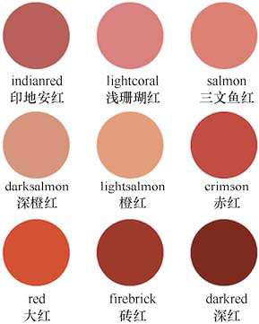
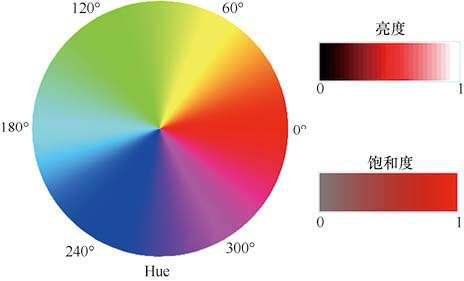
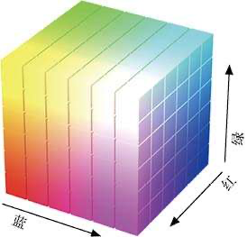
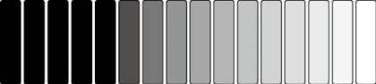
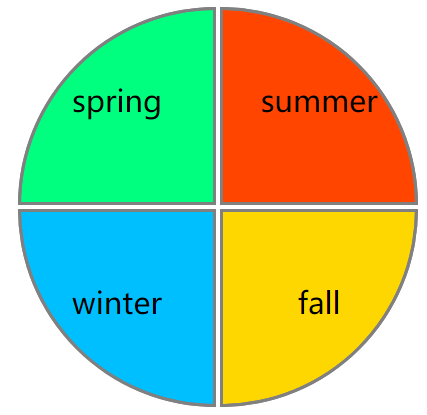
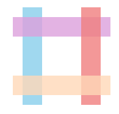

# CSS中的单位

# 1.0 长度
## 1.1 px
​	`px` 就是指像素点的数量，`100px` 就是100个像素点的长度，例如绘制下面这个放大镜：


​	需要用到下列样式：

```css
.magnifier {
            position: relative;
            color: dodgerblue;
        }
        .lens {
            position: absolute;
            width: 100px;
            height: 100px;
            border: 10px solid;
            border-radius: 50%;
        }
        .handle {
            position: absolute;
            width: 20px;
            height: 100px;
            border-radius: 0 0 10px 10px;
            background-color: currentColor;
            left: 100px;
            top: 100px;
            transform: rotate(-45deg);
            transform-origin: top;
        }
```

​	可以看到一共有八个属性用到了`px` 单位，如果我要把这个放大镜放大到2-5倍，那就需要同时修改这八个属性，而且需要计算放大之后的数值，调整起来很麻烦，`px` 是一个绝对单位，不推荐使用。

## 1.2 em

​	和绝对尺寸相对的就是相对尺寸，要使用相对尺寸，就得先确定一个基准，然后其他尺寸都以这个基准来计算大小，当要修改时，只需要修改一下基准值，其他尺寸就会自动按照比例进行改变。

​	`em` 是指相对于`font-size` 的大小，例如一个元素有属性`font-size: 10px` 那么`1em = 10px` ，如果一个容器内所有子元素都使用`em` 单位，那么需要调整容器大小时只需要调整`font-size` 的值即可。

例如把上面的放大镜改用`em` 单位：

```css
.magnifier {
            position: relative;
            color: dodgerblue;
            font-size: 10px;
        }
        .lens {
            position: absolute;
            width: 10em;
            height: 10em;
            border: 1em solid;
            border-radius: 50%;
        }
        .handle {
            position: absolute;
            width: 2em;
            height: 10em;
            border-radius: 0 0 1em 1em;
            background-color: currentColor;
            left: 10em;
            top: 10em;
            transform: rotate(-45deg);
            transform-origin: top;
        }
```

> 注：推荐在能用`em` 的情况下尽量使用`em` 单位

# CSS中的颜色

# 2.0 颜色

​	CSS提供了四种颜色表达方式：

## 2.1 颜色名称

​	指使用"red" "blue" "green"等这些颜色单词来表示颜色，例如：



## 2.2 HSL

​	HSL 是用色相（hue）、饱和度（saturation）和亮度（lightness）调配出的颜色，例如：



​	其中色相也就是我们日常说的“颜色”，左边的圆环就是色相，它的值是从0°到360°，也就是一个圆周角的角度，按彩虹色的顺序从0°开始排列，0°是红色，30°是橙色，60°是黄色，120°是绿色，180°是青色，240°是蓝色，300°是紫色，360°又回到红色。
​	饱和度是指纯色与灰色混合之后，纯色的占比，取值是0%到100%，100%表示未混入任何灰色的纯色，0%表示全灰。
​	亮度的取值范围也是从0%到100%，表示从暗到明的程度，0%表示全黑，100%表示全白，50%表示纯色。
因为纯色的饱和度是100%，亮度是50%，所以只要调整色相的度数，就可以得到不同的纯色，例如红色是`hsl(0, 100%, 50%)` ，绿色是`hsl(120, 100%, 50%)` ，蓝色是`hsl(240, 100%, 50%)` 。

## 2.3 RGB

​	RGB颜色模式是用红色、绿色、蓝色3色调配出的颜色，RGB色值是以`#` 号开头的6个十六进制数，每种颜色用2位十六进制表示，取值范围是从`#00`到`#ff` ，例如红色（red）是`#ff0000` ，绿色（green）是`#00ff00` ，蓝色（blue）是`#0000ff` ，黄色是`#ffff00` （红色和绿色混合），如图所示:



​	因为同比例的R、G、B颜色混合之后呈灰色，例如`#282828` 、`#676767` 、`#cacaca` 都是灰色，又因为若一个颜色的两个十六进制数字相同，可以缩写为一个数字，所以我们可以得到缩写的从`#000` （黑）到`#fff` （白）之间的16个灰度颜色，如图所示:



​	用RGB模式来记录颜色已经有100多年的历史了，电视机、显示器都是用这个原理显示颜色的，不过它不太易读，很难让人看到一个RGB色值就能估算出它大概的颜色。RGB颜色还有一种表示方法，就是用`rgb(r,g,b)` 的形式把3种颜色写成10进制数或百分比值，例如`#ff0000` 写成`rgb(255, 0, 0)` ，这比十六进制数稍好一点，不过还是不易读。

​	颜色名称、HSL 、RGB 可以混合使用，例如：

```css
        .seasons div:nth-child(1) {
            border-radius: 100% 0 0 0;
            background-color: springgreen;
        }
        .seasons div:nth-child(2) {
            border-radius: 0 100% 0 0;
            background-color: #ff4500;
        }
        .seasons div:nth-child(3) {
            border-radius: 0 0 100% 0;
            background-color: rgb(255,215,0);
        }
        .seasons div:nth-child(4) {
            border-radius: 0 0 0 100%;
            background-color: hsl(195,100%,50%);
        }
```

效果：



## 2.4 HSLA/RGBA

​	HSLA/RGBA比HSL/RGB多出的最后一个A，学名叫“alpha”通道，实践中我们把它当作一个不透明度值对待，取值范围是从0到1，0表示完全透明，那么这个颜色就像不存在一样，1表示完全不透明，就像没有设置过这个值一样，0.5当然就表示半透明了。例如：

```css
        .hashtag div:nth-child(1) {
            left: 10%;
            background-color: hsla(197,71%,73%,0.8);
        }
        .hashtag div:nth-child(2) {
            top: 10%;
            background-color: hsla(300,47%,75%,0.8);
        }
        .hashtag div:nth-child(3) {
            right: 10%;
            background-color: hsla(0,79%,72%,0.8);
        }
        .hashtag div:nth-child(4) {
            bottom: 10%;
            background-color: hsla(28,100%,86%,0.8);
        }
```



## 2.5 transparent

​	transparent关键字表示透明色，就像透明玻璃一样，用户看不到这个颜色。单独使用`color: transparent` 的意义不大，因为有不止一种方法可以实现相同的效果，例如通过在RGBA/HSLA模式下把A值设置为0，或者使用`visibility: hidden` 属性。
​	transparent主要是用在一系列颜色中，例如通过把元素的4个边框中的3个边框设置为透明色，再加上其他样式，就可以创作出三角形；再如元素的背景是多种颜色生成的渐变色时，在其中有规律地加入透明色，则可以创作出条纹背景。

> CSS中的颜色单词与值对照表：https://mp.weixin.qq.com/s/deVCheW0nkNFhwnGbjl-zw